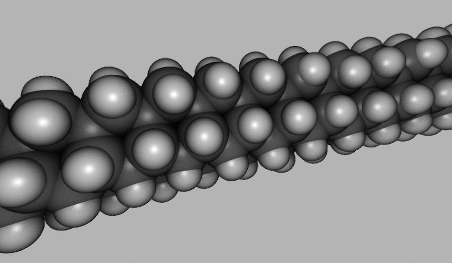

# Diamond Rope

Author: Philip Turner

Description: small beam of diamond that is flexible enough to be treated as rope, under some circumstances.

Parameters:
- Height (Float) - Measures the cross-section, typically 1-2 unit cells. Must have .5 in the decimal place.
- Width (Float) - Measures the cross-section, typically 1-2 unit cells. Must be divisible by 0.5.
- Length (Int) - Measures the distance between two ends of the rope, typically several dozen unit cells. This is the number of cells along a diagonal (TODO: explain in more detail).

Improvements: a variant could be made using hexagonal diamond, which interfaces directly with (111) surfaces. At the time of creation, the software for designing the rope only supported cubic diamond. The hexagonal diamond version would likely include only a "Radius (Float)" parameter, instead of two "Height" and "Width" parameters.
